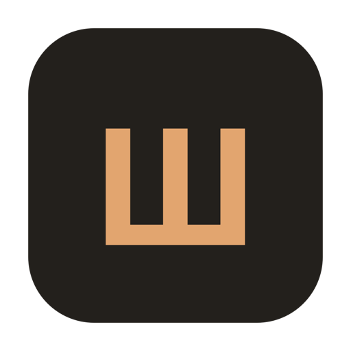

<p align="center">
  
</p>

<h1 align="center">Šapat</h1>

<p align="center">A native macOS menu bar app that turns Serbian speech into polished English — on-device.</p>

<p align="center">
  <a href="https://github.com/pavstev/Sapat/actions/workflows/ci.yml"></a>
  <a href="https://github.com/pavstev/Sapat/releases/latest"></a>
  
  <a href="LICENSE"></a>
</p>

---

Press `⌥⇧Space` (or click the menu bar **Ш**), speak Serbian, and Šapat transcribes it
on-device with [WhisperKit](https://github.com/argmaxinc/argmax-oss-swift), translates it
to English, shows both, and copies the English to your clipboard. Everything runs on your
Mac. A local [Ollama](https://ollama.com) model polishes the translation *if available* —
the app works fully without it.

> *Šapat* (шапат) is Serbian for "whisper" — a nod to the on-device Whisper engine. The
> icon is **Ш**, the Cyrillic letter that opens the word.

## Features

- **On-device transcription** — WhisperKit `large-v3` with VAD chunking for long-form Serbian.
- **Polished translation** — local Ollama `qwen2.5:3b` when running; Whisper's translate task as an offline fallback.
- **Live waveform** — the menu bar **Ш** animates with your voice while recording.
- **Searchable history** — every translation saved locally and re-copyable.
- **Tone & glossary** — polished / formal / casual / literal, plus a custom glossary.
- **Global hotkey** — `⌥⇧Space` from any app.
- **Automatic updates** — checks GitHub Releases, then downloads, verifies, and installs in place.

## Install

One-line installer (cleans up any prior install, downloads the latest release, strips the
Gatekeeper quarantine, installs to `/Applications`, and launches):

```sh
curl -fsSL https://raw.githubusercontent.com/pavstev/Sapat/main/scripts/install.sh | bash
```

Or hand an AI agent (Claude Code, Cursor, …) a link to this repo and ask it to "set up
Šapat" — it follows [`AGENTS.md`](AGENTS.md). To reset first: `./scripts/cleanup.sh [--purge]`.

On first launch Šapat downloads the `large-v3` model (~2.9 GB) and asks once for the
microphone. The app is **ad-hoc signed** (no paid Apple Developer account), so a manual
install needs a one-time `xattr -dr com.apple.quarantine /Applications/Sapat.app`.

### Optional: polished translations with Ollama

```sh
brew install ollama && ollama pull qwen2.5:3b && ollama serve
```

When Ollama runs, `qwen2.5:3b` produces cleaner English and honors your tone + glossary.

## How it works

```
record (16 kHz mono WAV)
   └─ WhisperKit (large-v3, VAD)  ──▶  Serbian transcript        (task: transcribe, lang: sr)
        └─ translate:
             ├─ Ollama qwen2.5:3b  ──▶  polished English         (preferred; tone + glossary)
             └─ WhisperKit          ──▶  English baseline         (offline fallback)
   └─ show both, auto-copy English, save to history
```

State machine: `preparing → idle → recording → transcribing → translating → done` (+ `error`).
The global hotkey uses Carbon's `RegisterEventHotKey` — no third-party dependency.

## Updating

Šapat auto-updates: it checks GitHub Releases on launch, downloads the new build,
verifies its checksum, swaps the bundle in place while idle, and relaunches. Toggle it off
in Settings to update manually via the footer **↻**, or just re-run the installer.

## Build from source

No full Xcode needed — Šapat builds with the Command Line Tools via SwiftPM.

```sh
xcode-select --install            # if you don't have the CLT
git clone https://github.com/pavstev/Sapat.git && cd Sapat
./bundle.sh && open Sapat.app     # swift build + assemble & ad-hoc sign
```

Overrides: `SAPAT_VERSION=1.2.3` stamps a version; `SAPAT_UNIVERSAL=1` builds universal
(arm64 + x86_64). Tests: `swift test`. The icon is generated by `swift scripts/make-icon.swift`.

## Releasing

Tag-triggered and fully automated by [`release.yml`](.github/workflows/release.yml):

```sh
git tag v1.2.0 && git push origin v1.2.0
```

The workflow builds, zips with `ditto`, and publishes a GitHub Release. Every push/PR to
`main` is build-checked + tested by [`ci.yml`](.github/workflows/ci.yml).

## Project layout

| Path | Responsibility |
| --- | --- |
| `Sources/Brand.swift` | Single source of truth for name, bundle id, repo slug, paths |
| `Sources/SapatApp.swift` | `@main` entry; app delegate adaptor + Settings scene |
| `Sources/AppDelegate.swift` | Status item, popover, hotkey, menu-bar glyph + waveform |
| `Sources/RecorderViewModel.swift` | `@Observable @MainActor` recording/translation logic |
| `Sources/WhisperEngine.swift` | WhisperKit wrapper (transcribe + translate, VAD, prewarm) |
| `Sources/OllamaClient.swift` | Ollama `/api/generate` client + tone/glossary prompt |
| `Sources/UpdateChecker.swift` | GitHub Releases auto-updater (download → verify → swap) |
| `Sources/HistoryStore.swift` · `HistoryView.swift` | JSON-backed history + searchable UI |
| `Sources/PopoverView.swift` · `Theme.swift` | SwiftUI popover + copper-on-stone design tokens |
| `Sources/GlobalHotKey.swift` | Carbon `RegisterEventHotKey` wrapper (⌥⇧Space) |
| `bundle.sh` · `scripts/` · `.github/workflows/` | Build/assemble, install/cleanup, CI + release |

## Notes

- First run downloads `large-v3` (~2.9 GB); cached thereafter.
- Releases are ad-hoc signed (not notarized). The offline Whisper translation is rougher than Ollama's polish.
- Bundle id: `com.stevanpavlovic.Sapat`.

## Dependencies

- [WhisperKit](https://github.com/argmaxinc/argmax-oss-swift) — on-device speech (pinned to 1.0.0)
- [Ollama](https://ollama.com) + `qwen2.5:3b` — optional translation polish

## License

[MIT](LICENSE) © Stevan Pavlović
